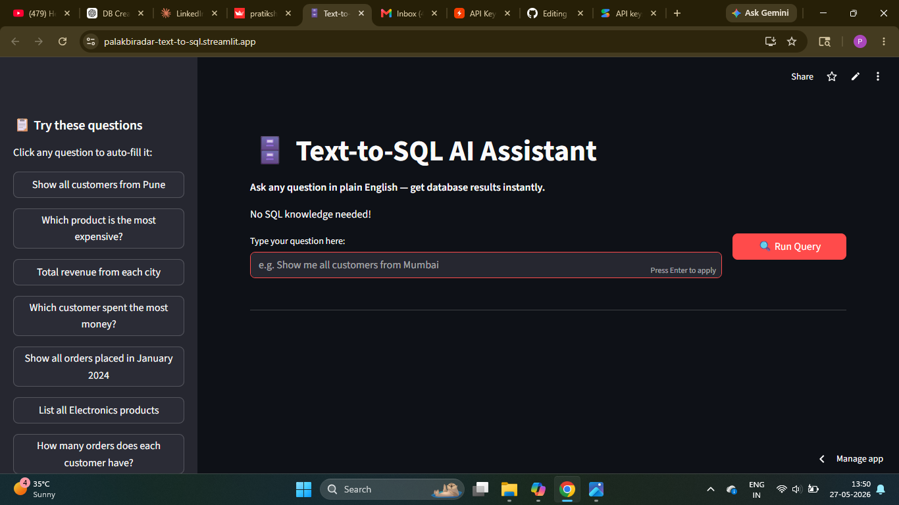
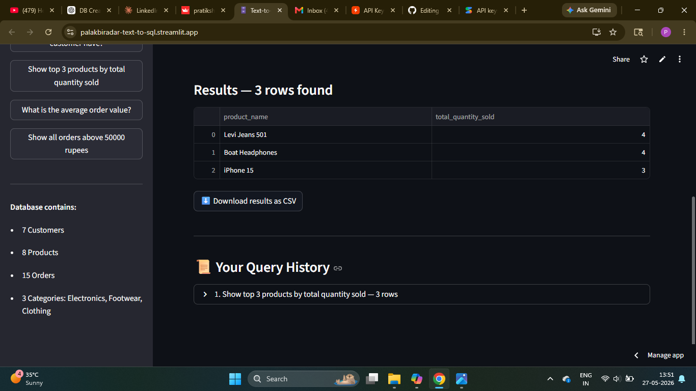

# 🗄️ Text to SQL AI Assistant

> Convert natural language questions into SQL queries instantly — no coding needed.

## 🌐 Live Demo
👉 https://palakbiradar-text-to-sql.streamlit.app

---

## 📌 Problem Statement
Non-technical users struggle to extract insights from databases 
because they don't know SQL. Business teams waste hours waiting 
for developers to write queries for them.

Text to SQL AI solves this by letting anyone ask questions in 
plain English and instantly getting accurate SQL queries and 
results — reducing query-writing effort by 60%.

---

## ✨ Features
- ✅ Natural language to SQL conversion
- ✅ Gemini API powered query generation
- ✅ Live database query execution
- ✅ Results displayed in clean table format
- ✅ E-commerce sample database included
- ✅ No SQL knowledge required
- ✅ Streamlit Cloud deployed

---

## 🧠 System Workflow

User Question → Gemini LLM → SQL Query → Database → Results Table

---

## 🛠️ Tech Stack

| Category | Technology |
|---|---|
| Language | Python |
| Frontend | Streamlit |
| LLM | Gemini API |
| Database | SQLite |
| Deployment | Streamlit Cloud |
| Version Control | GitHub |

---

## 📂 Project Structure

text-to-sql-ai/
├── app.py              # Main Streamlit application
├── sql_chain.py        # LLM to SQL chain logic
├── database.py         # Database setup and connection
├── ecommerce.db        # Sample SQLite database
├── requirements.txt    # Dependencies
└── README.md

---

## 📸 Screenshots

## 📸 Screenshots

### Main Interface

### Query Results

### Dashboard

---

## ⚙️ Installation & Setup

### 1️⃣ Clone Repository
git clone https://github.com/pratikshabiradar19/text-to-sql-ai.git
cd text-to-sql-ai

### 2️⃣ Create Virtual Environment
python -m venv venv
venv\Scripts\activate

### 3️⃣ Install Dependencies
pip install -r requirements.txt

### 4️⃣ Configure API Key
Create a .env file:
GEMINI_API_KEY=your_api_key_here

Get your free Gemini API key at 👉 https://makersuite.google.com/app/apikey

### 5️⃣ Run Application
streamlit run app.py

---

## 💡 Example Queries You Can Ask

| Natural Language | Generated SQL |
|---|---|
| Show all customers | SELECT * FROM customers |
| Top 5 products by sales | SELECT * FROM products ORDER BY sales DESC LIMIT 5 |
| Total revenue this month | SELECT SUM(amount) FROM orders WHERE... |

---

## 🔥 Key Highlights
- Reduces SQL query writing effort by 60%
- Works for non-technical business users
- Gemini LLM understands database schema automatically
- Clean and simple UI built with Streamlit
- Production deployed on Streamlit Cloud

---

## 🚀 Future Improvements
- [ ] Support for PostgreSQL and MySQL
- [ ] Multi-table join query support
- [ ] Query history and export
- [ ] Upload custom database
- [ ] Voice input support
- [ ] FastAPI backend

---

## 👩‍💻 Author
**Pratiksha Biradar**
Gen AI Developer | AI Engineer | Data Scientist

- GitHub: https://github.com/pratikshabiradar19
- LinkedIn: https://www.linkedin.com/in/pratiksha-biradar-979b98315

---

## ⭐ Support
If you like this project, give it a star ⭐ and share it!
